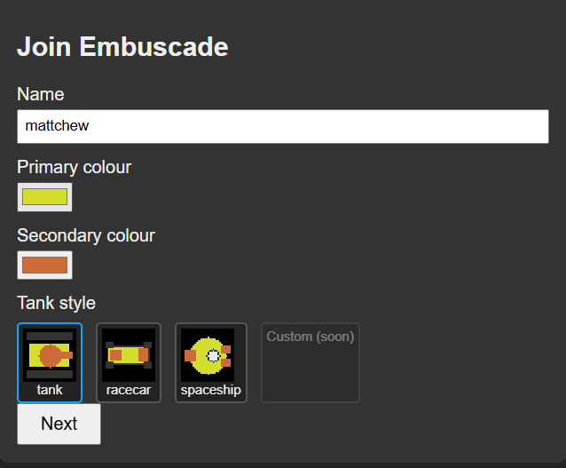
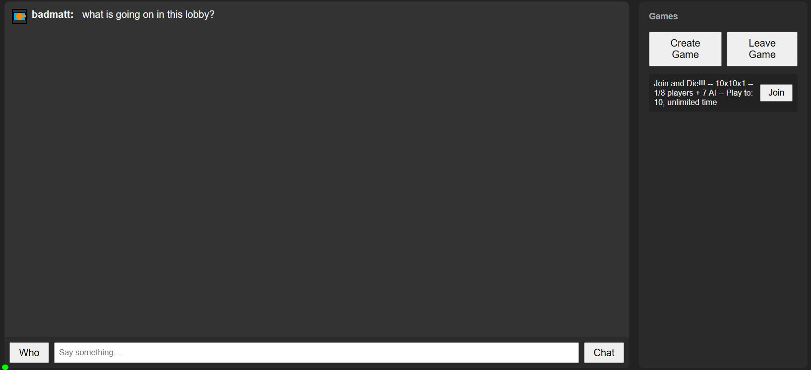
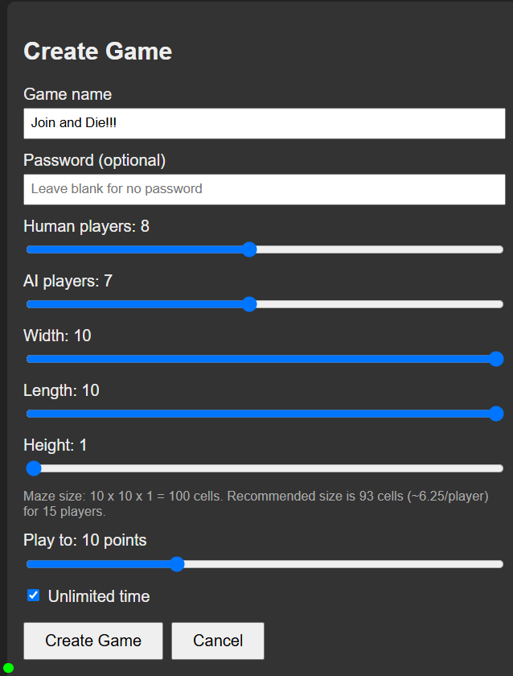
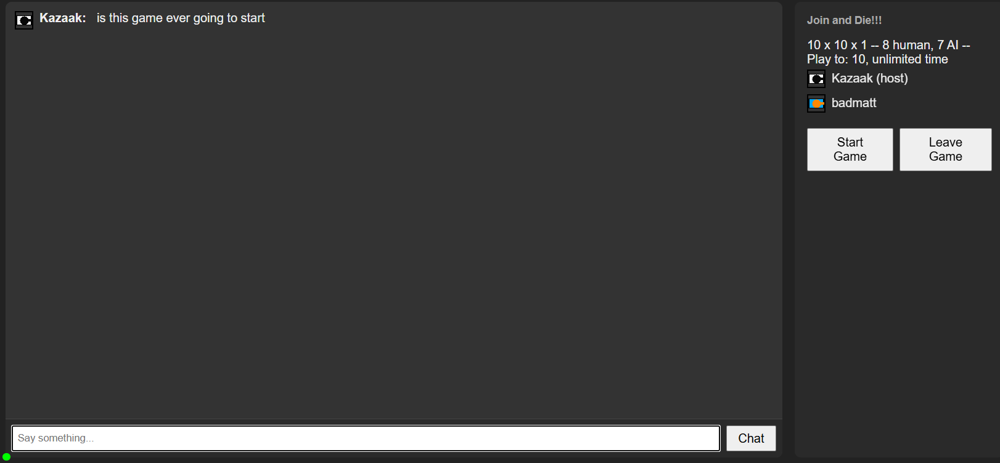
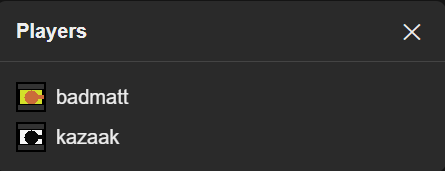
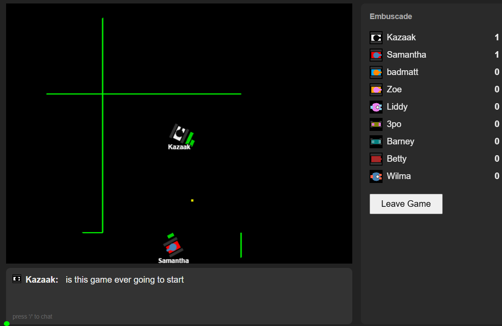
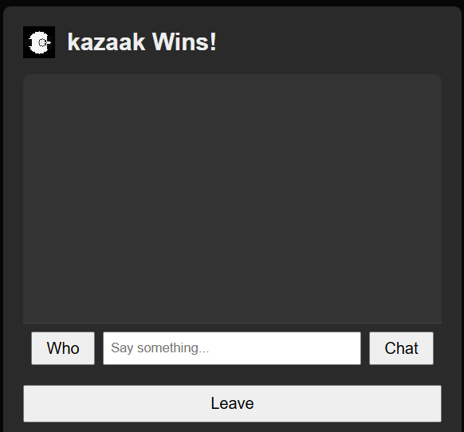

# The little green dot

The little green dot in the lower-left hand corner shows the server connection
status.  Although not obvious from the context, the game runs as a separate
server.  This green dot indicates the connection to the server is active.

You may lose connection to the server periodically, e.g., with network
hiccoughs.  It should automatically reconnect after a short period.  If the
server is ever down, embuscade cannot be played.

# Voice chat

🔊🔇

Next to the little green dot is the voice chat icon.  🔇 indicates voice chat is
disabled.  It is disabled everywhere except the Start Game Lobby, the Game
itself, and the End Game Dialog.  On those screens, voice chat can be toggled on
and off with the right control button.  On reverting to the Browser Lobby, the
voice chat state is saved for the next game joined.

# Joining the game

To play embuscade you must first create your persona: i.e., the name by which
you are known, the style of tank you drive, and the primary and secondary
colours which distinguish you from other players.  The Join game dialog shows
choices for the style of tank that update as you modify primary and secondary
colours.  The tank icon with primary and secondary colours is how you are
identified in lists of players and chat.

Clicking Next drops you into the Browser Lobby.

# The Browser Lobby

The Browser Lobby shows a list of available games which may be joined and
permits the creation of a new game.  The games available to join are in the
right rail.

Games are configurable - maze size, total number of players, and victory
conditions.  These conditions are summarised in the list of available games.  In
addition, a game may be password-protected to restrict who's able to join.

You can join a game by clicking the join button that appears next to it.  If a
game appears in the Browser Lobby and it is not password protected, the host
wants players to join.  Don't be shy.  When you join a game, you enter the Start
Game Lobby.

The main region of the Browser Lobby is for players to chat.  Enter a chat
message in the provided text box and click chat to send a message.

The who button appears on screens when the other players aren't listed.  It's
described below under [who dialog](#Who-Dialog) below.

Finally, the Create Game button allows for creation of new games, which in turn
appear in the Browser Lobby.

# Game Creation

When creating a game, the following fields are configurable:

* Name.  Required.  This is the name of the game as it appears in the Browser
  Lobby
* Password.  Optional.  If specified, players entering the game will be
  challenged to enter this value.
* Human Players.  Required.  The number of human players.  This is the total
  number of humans who can join the game, including the host.
* AI Players.  Required.  The number of ai players in the game
* Length, Width, and Height.  Required.  The dimensions of the maze
* Play to: the target score for victory
* Unlimited Time / Time Limit.  Required.  If unchecked, provide a time limit at
  which the game ends

Clicking Create Game drops you into the Start Game Lobby

# The Start Game Lobby

The Start Game Lobby is where you wait for other players to join.  The host is
the player who creates the game and can click the Start Game button, which
starts the game.  As with the Browser Lobby, players can chat in the Start Game
Lobby before the game starts.  The game starts when the host clicks the Start
Game button.

The Start Game Lobby displays information about the game and lists the human
players who have joined in the right rail.

If the host disconnects, he or she can reconnect within 60 seconds.  Barring
that, after 60 seconds a new host is chosen among the other human players.  The
original host can rejoin, but the new host remains the same.

After the game ends, players are presented with the End Game Dialog.  Leaving
that dialog returns to the lobby.  Any players still on the Leave Game Dialog
are greyed out; the host is only able to restart the game when all players have
left the Leave Game Dialog.

# Who Dialog

The who button shows the players connected on screens where the players aren't
listed.  E.g., there's no who button in the Start Game Lobby because the players
are listed on the right rail.  Note that clicking the who button on the game
finish screen lists the AI players too.  It's a feature, not a bug!

# Playing the Game

The game is played on a random maze using [Wilson's
Algorithm](https://en.wikipedia.org/wiki/Maze_generation_algorithm).  You
control a tank with the arrow keys on the keyboard.  Pushing forward accelerates
and pushing backwards decelerates.  Fire on your opponents using w, a, s, and d
keys.  I.e., pressing w fires forward, whichever direction the tank is facing.

Tanks start with 100 health and take damage in the following ways:

* shot by another tank.  The default bullet inflicts 25 points of damage
* collision with another tank.  Damage is based on the momentum of the tanks on
  impact
* collision with the wall.  As with real life, walls are veritable death traps.
  Be wary

Power-ups spawn on a regular interval throughout the course of the game.
Currently, there are two power ups:

* `⚕️`: health.  Restores 50 health towards the current max health.
* `💗`: health boost.  Increases max health to a total of 200 and instantly
  restores 100 health
* : ram's horns.  Absorbs 75 points of
  ramming damage - both collisions with other tanks and walls.  Imputes 1.5x
  more ramming damage
* : bumper.  Absorbs 200 points of wall damage.

The game commences until one player reaches the maximum score or the time limit
expires.

Sometimes the chat will show that one player slew another player, but the
scoreboard does not update.  This is because a ramming death in which both
players die does not count towards the score.

# End Game Dialog

When the victory condition is met - i.e., when a player reaches the configured
total score or the time limit expires, the End Game Dialog is shown.  This
simply shows the winner and allows players to chat.  Leaving the End Game Dialog
returns the player to the Start Game Lobby.  Once all players have left the End
Game Dialog, the host may opt to restart the game.
